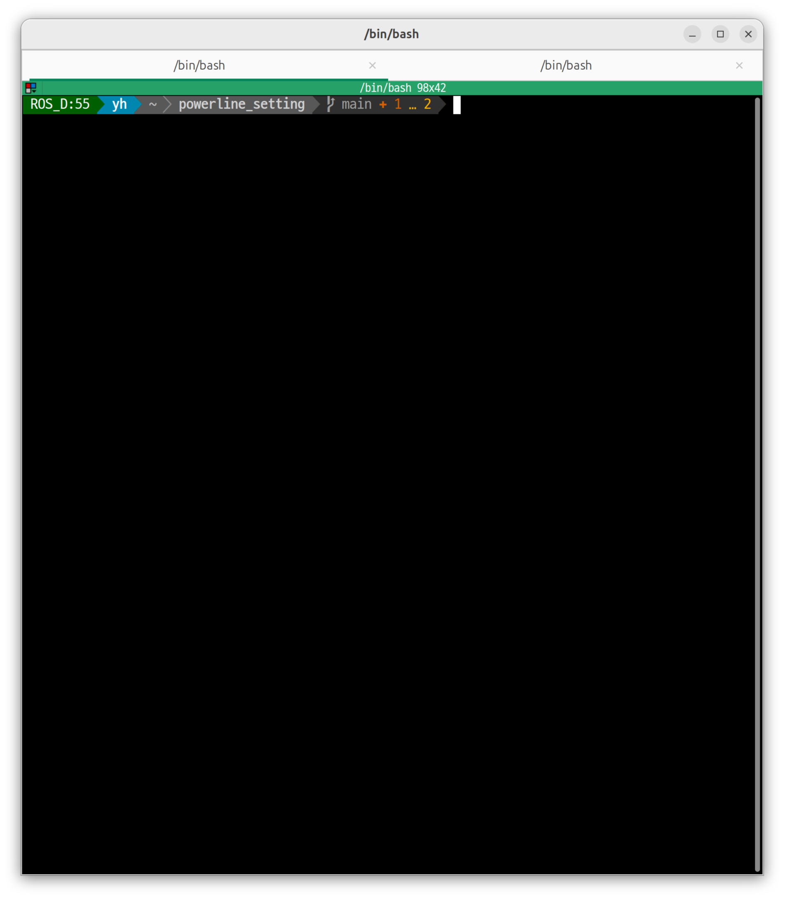
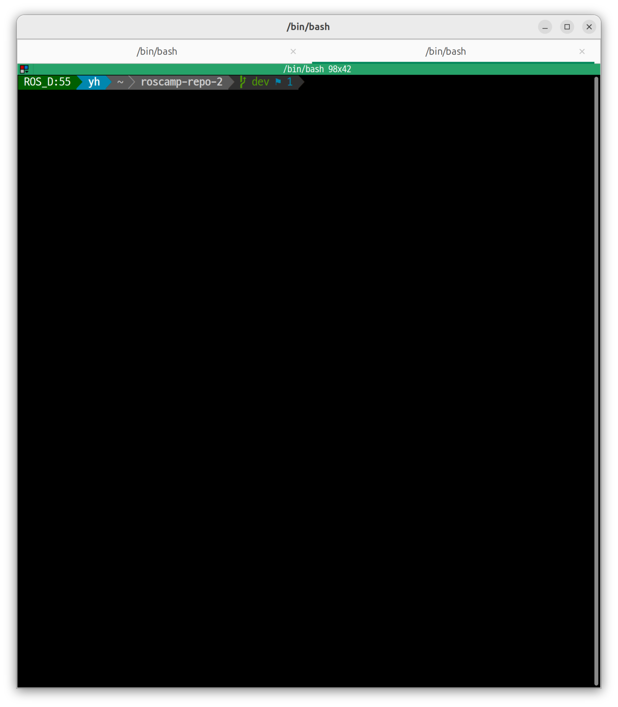
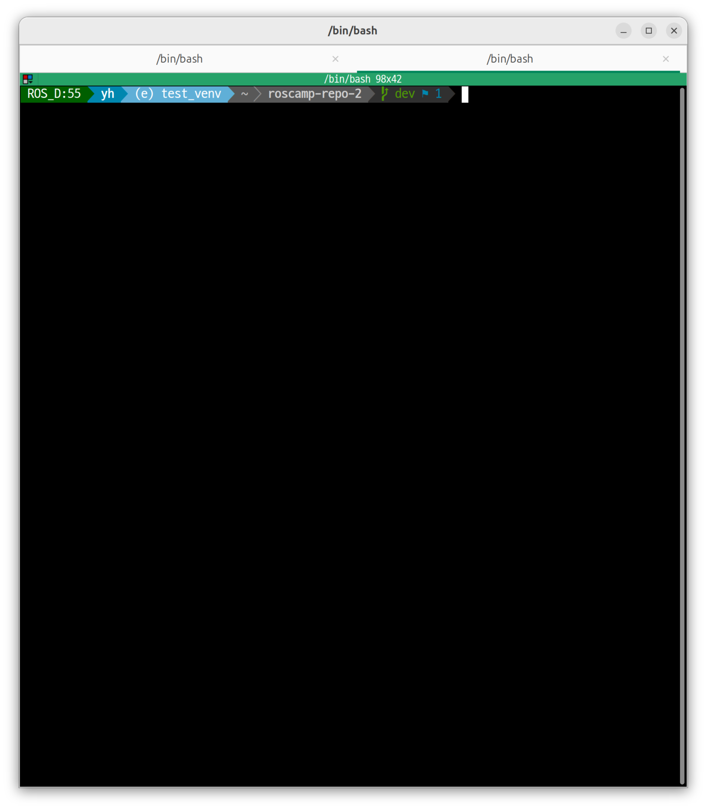

# powerline_setting
Powerline Setting 백업 겸 파일 공유를 위해 만든 repository

## Font 설치 (중요)
Powerline을 사용하면 특정 기호들이 필요한데

일반 font에는 해당 기호들이 없어서 깨져서 보임

Naver에서 만들어서 한글도 잘 보이고 고정폭 font인 D2Coding 설치

설치하지 않고 아래 과정을 진행하면 깨져 보이는 부분이 보임


https://github.com/naver/d2codingfont/releases


위 링크로 가셔서 압축 파일 다운로드

압축 해제 후 확장자가 ttf인 파일들을 파일 탐색기로 open 후 설치

D2Coding 디렉토리 내 폰트들만 설치해도 되나 D2CodingLigature 내 폰트를 설치해도 상관 없음

(Ligature : 기호 관련 특수 폰트들 존재)


## 설치 및 실행
```
cd powerline_setting
# 실행 권한이 없으면 chmod +x setup.sh
./setbup.sh # 비밀번호 입력 필요
```
이후 사용하는 Terminal에서 Font를 위에서 설치한 D2Coding으로 지정 후

Terminal 종료 후 재시작

## Screenshot
<details>
<summary>Screenshot 보기</summary>






</details>
